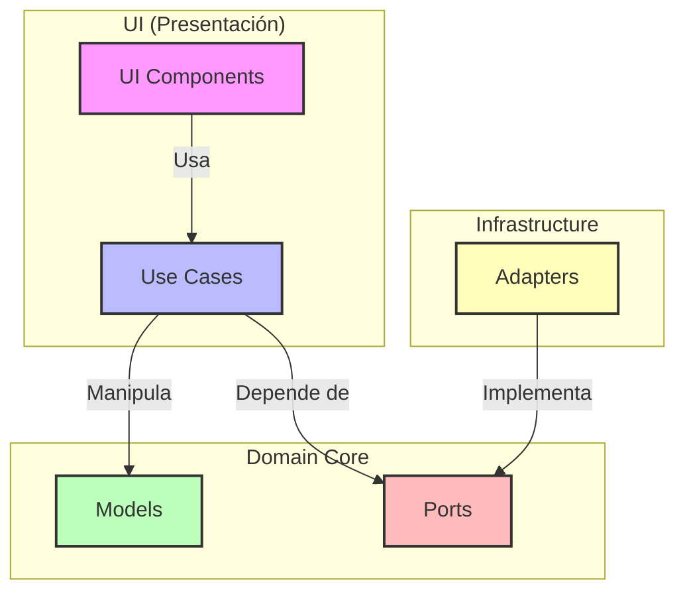
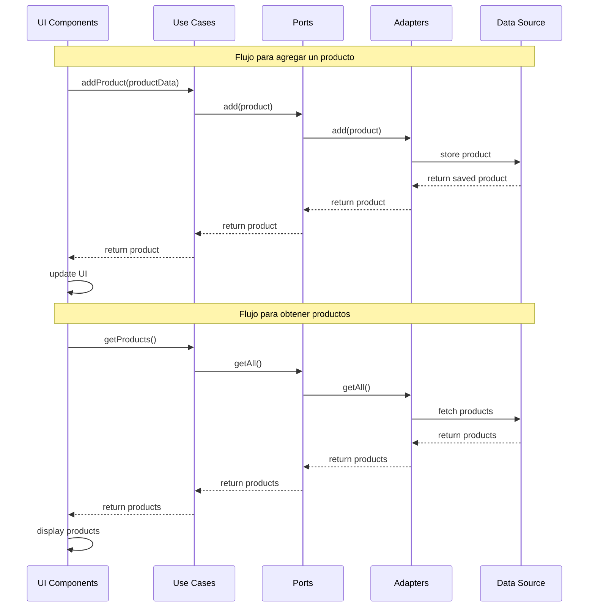
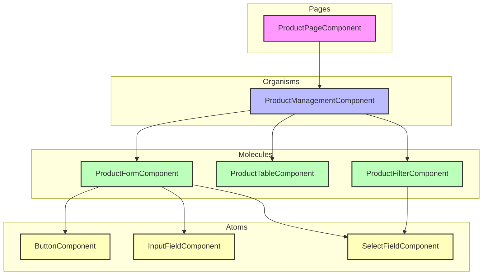

# 1. Resumen General

La aplicación es un sistema de gestión de productos utilizando angular, donde se implemento la arquitectura Hexagonal

## Caracteristicas Implementadas

- 🛒 **Gestión de Productos**:

  - Agregar productos con nombre, descripción, precio y categoria.
  - Listar todos los productos en una tabla.

- 🔍 **Filtrado por Categorias**: Filtrar los productos por las categorias creadas en este caso Electronica, Libros, Ropa y Alimentos

- 🏗️ **Arquitectura Hexagonal**: Implementación completa separando:
  - Core (Dominio, Puertos, Casos de Uso)
  - Infrastructure (Adaptadores, Factories)
  - UI (Componentes utilizando Atomic Design)

- 🧩 **Atomic Design**: Estructuración de componentes UI en átomos, moléculas, organismos y páginas.

- 🧪 **Pruebas Unitarias**: Cobertura de casos de uso y componentes principales.

## Arquitectura Hexagonal

La implementación de la arquitectura hexagonal se dividió el código en tres capas principales:

## Core (Núcleo)

Esta capa contiene la lógica del negocio y es independiente de factores externos.

- **Domain**:
  - Modelos de dominio como `Product`
  - Enumeraciones como `ProductCategory`
  - DTOs para operaciones especificas.

- **Ports**:
  - Interfaces que definen para comunicación con capas externas
  - ``ProductRepositoryPort``: Define los metodos requeridos para gestionar los productos

- **UsesCases**:
  - ``AddProductUseCase``: Logica para crear nuevos productos
  - ``GetProductUseCase``: Obtiene todos los productos
  - ``GetProductsByCategoryUseCase``: Filtra los productos por categoria

## Infrastructure

Implementación de los adaptadores que conectan al `Core` con el mundo exterior.

- **Adapters**:
    - `InMemoryProductRepositoryAdapter`: Crea las instancias de los repositorios
    - Tambien almacena los datos en la memoria para el desarrollo y pruebas, (Es decir al momentos de Cerrar el programa se pierde la info)

- **Factories**: 
    - `ProductRepositoryFactory`: Crea las instancias de los repositorios.
    - Proporciona metodos como `CreateInMemory()` y `CreateHttp()` lo que hace es encapsular la creación de diferentes implementaciones.
    - Facilita la implementación sin modificar el codigo cliente, es decir que para usar una base de datos real o un API, solo se tendria que configurar la inyección de dependencias en `app.config.ts`, sin afectar nada mas. 

## UI (Interfaz de Usuario)

Se implementa el patrón Atomic Desing usado para organizar los componentes.

- **Atoms**: Son los componentes basicos para ser reutilizados.
    - `ButtonComponent`
    - `InputFieldComponent`
    - `SelectFieldComponent`

- **Molecules**: Es la combinación de los atomos, para cumplir una funcionalidad
    - `ProductFilterComponent`
    - `ProductFormComponent`
    - `ProductTableComponent`

- **Organisms**: Componentes mas complejos que son integrados por multiples moleculas
    - `ProductManagementComponent`

- **Pages**: Contenedores a nivel superior, que basicamente representan las paginas completas.
    - ``ProductPageComponent``: Actua como el contenedor principal que integra el header y el organismo de  ``ProductManagementComponent``


## Tecnologias Utilizadas

|Tecnologias|Función|Versión|
|-----------|-------|-------|
|Angular| Framekork Principal| 19.2.0|
|RxJS|Para la programación Reactiva|~7.8.0|
|Jasmine| Para Pruebas |~5.6.0|
|TypeScript| Lenguaje de programación|~5.7.2|

#Requisitos del sistemas

|Programa| Versión|
|-------|---------|
|Node.Js|22.14.0|
|NPM|11.2.0|
|Angular CLI|19.2.5|

#Instalación

    1. Clonar el repositorio
```bash
    git clone https://github.com/Astract1/prueba-tecnica-frontend.git
    cd prueba-tecnica-frontend
```
    2. Instalar las dependencias

 ```bash
   npm install
```

    3. Iniciar el servidor 
 ```bash
   ng server --open
```


## Ejecución de Pruebas

Ejecutar pruebas unitarias

 ```bash
   ng test
```
## Estructura del proyecto

```src/
├── app/                                # Directorio principal de la aplicación
│   ├── core/                           # Capa de dominio y lógica de negocio
│   │   ├── domain/                     # Modelos y entidades de dominio
│   │   ├── ports/                      # Interfaces (puertos) para comunicación con capas externas
│   │   │   └── repositories/           # Interfaces para repositorios
│   │   │
│   │   └── usecases/                   # Implementación de casos de uso
│   │
│   ├── infrastructure/                 # Capa de infraestructura
│   │   ├── adpaters/                   # Implementaciones concretas de los puertos
│   │   │   └── repositories/           # Implementaciones de repositorios
│   │   │
│   │   └── factories/                  # Fábricas para crear instancias
│   │
│   ├── ui/                             # Capa de presentación (interfaz de usuario)
│   │   ├── atoms/                      # Componentes atómicos (indivisibles)
│   │   │   ├── button/                 # Componente de botón
│   │   │   ├── input-field/            # Componente de campo de entrada
│   │   │   └── select-field/           # Componente de selector
│   │   │
│   │   ├── molecules/                  # Componentes moleculares (compuestos por átomos)
│   │   │   ├── product-filter/         # Filtro de productos por categoría
│   │   │   ├── product-form/           # Formulario para crear productos
│   │   │   └── product-table/          # Tabla para mostrar productos
│   │   │
│   │   ├── organisms/                  # Componentes complejos
│   │   │   └── product-management/     # Gestión completa de productos
│   │   │
│   │   └── pages/                      # Páginas completas
│   │       └── product-page/           # Página principal de productos
│   │
│   └── app-modules/                    # Módulos y configuración de la aplicación
│
├── assets/                             # Recursos estáticos (imágenes, fuentes, etc.)
└── environments/                       # Configuraciones de entorno (dev, prod)
```


## Diagramas

### Arquitectura Hexagonal




### Diagrama del Flujo de datos



### Diagrama de componentes de UI (Atomic Desing)

